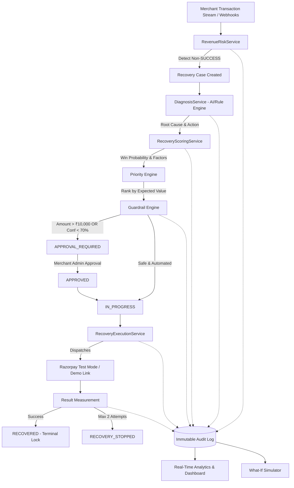

# RecoverAI — Autonomous Revenue Recovery Agent

> **Razorpay Buildathon — AI Revenue Recovery Track**  
> An autonomous agent that detects, diagnoses, scores, guardrails, and recovers at-risk revenue for digital merchants in real-time.

---

## 1. System Overview

**RecoverAI** replaces dumb dunning rules with an intelligent, guardrailed agent that executes a closed-loop recovery lifecycle:

$$\text{Detect} \longrightarrow \text{Diagnose} \longrightarrow \text{Estimate Recoverability} \longrightarrow \text{Prioritize} \longrightarrow \text{Recommend Action} \longrightarrow \text{Apply Guardrails} \longrightarrow \text{Execute} \longrightarrow \text{Measure} \longrightarrow \text{Audit}$$



---

## 2. Project Architecture

```
RecoverAI/
├── app/                            # FastAPI Python Backend
│   ├── main.py                     # App entry point & global CORS/exception handlers
│   ├── core/                       # Config, database, security & logging
│   ├── models/                     # SQLAlchemy 2.x ORM models
│   ├── schemas/                    # Pydantic v2 validation models
│   ├── api/routes/                 # REST API endpoints
│   ├── services/                   # Business logic (Detection, Diagnosis, Scoring, Guardrails, Execution)
│   ├── integrations/razorpay/      # Razorpay client & service
│   └── seed/                       # Deterministic synthetic data seeder
├── tests/                          # 34 Pytest unit/integration tests (100% passing)
├── frontend/                       # React 19 + TypeScript + Vite + Tailwind CSS Frontend
│   ├── src/
│   │   ├── api/                    # Centralized API service layer (zero scattered fetch calls)
│   │   ├── components/             # Polished fintech UI components & charts
│   │   ├── routes/                 # 9 complete pages (Overview, Risk, Recovery, Transactions, Insights, Simulator, Audit, Demo, Settings)
│   │   └── types/                  # Typed TypeScript interfaces matching backend models
│   ├── package.json
│   └── vite.config.ts
├── run.py                          # Backend launcher
└── README.md
```

---

## 3. Quick Start & Execution

### 1. Start the Backend Server (Terminal 1)
```bash
# In project root (RecoverAI)
python -m app.seed.seed_database
python run.py
```
* Backend API: `http://127.0.0.1:8000`
* Swagger Docs: `http://127.0.0.1:8000/docs`
* Health Check: `http://127.0.0.1:8000/api/health`

### 2. Start the Frontend Application (Terminal 2)
```bash
cd frontend
npm install
npm run dev
```
* Frontend Dashboard: `http://localhost:3000` (or `http://localhost:5173`)

### 3. Run Backend Tests
```bash
python -m pytest -v
```
*(34 passed / 34 total)*

### 4. Build Frontend for Production
```bash
cd frontend
npm run build
```

---

## 4. Completed Frontend Pages

1. **Overview / Dashboard** (`/`):
   - Dynamic KPIs: Total Revenue at Risk, Estimated Recoverable Revenue, Actual Recovered Revenue, Recovery Rate %, Active Recovery Cases, High Priority Exceptions.
   - 14-day Recovery Trend Chart & Revenue Leak Breakdown Donut Chart.
   - Priority Recovery Opportunities table with drawer inspection.
2. **Revenue Risk** (`/revenue-risk`):
   - Real-time transaction leakage scanner with "Scan for Revenue Leaks" trigger.
   - Search, multi-tab filters (Detected, Diagnosed, Approval Required, Recovered, High Priority), and sorting.
3. **Recovery Center** (`/recovery-center`):
   - Command center for active recovery cases.
   - Inspect AI diagnosis, root cause, win probability ring, priority score, and guardrail decisions.
   - Interactive actions: **Analyze**, **Approve**, **Reject**, and **Execute Recovery** (respecting backend state machine).
4. **Transactions** (`/transactions`):
   - Complete transaction explorer with search and filters by status (`SUCCESS`, `FAILED`, `ABANDONED`, `OVERDUE`, `RECOVERED`), payment method (`UPI`, `CARD`, `NETBANKING`, `MANDATE`, `WALLET`), and transaction type.
   - Single transaction detail view (`/transactions/$transactionId`) with step-by-step cognitive workflow strip and timeline.
5. **AI Insights** (`/insights`):
   - Largest Revenue Leak and Highest-Value Opportunity highlight banners.
   - AI Executive Recommendations synthesized from real transaction failure patterns.
6. **What-If Simulator** (`/simulator`):
   - Interactive parameters: Recovery Freshness Window (24/48/72h), Max Automated Attempts (1-3), Minimum Win Probability Floor (50/70/80%).
   - Strategy comparison chart and active mathematical model assumptions.
7. **Immutable Audit Trail** (`/audit-trail`):
   - Chronological audit table recording event type, actor (RecoverAI Agent, Merchant Admin, Guardrail Policy), action, result, and reason.
8. **Pitch Demo Hub** (`/demo`):
   - **Scenario A (Priya Nair - ₹3,000)**: 1-Click Autonomous Recovery → `RECOVERED`.
   - **Scenario B (Arjun Kumar - ₹25,000)**: High-Value Guardrail → `APPROVAL_REQUIRED` → Merchant Admin Approve → Execute.
   - **Scenario C (Meera Thomas - ₹4,999)**: 1-Click Safe Failure Sequence → Max Retries Reached → `RECOVERY_STOPPED`.
9. **Settings & System Diagnostics** (`/settings`):
   - Backend health diagnostics, active AI engine, payment gateway mode, and 1-click synthetic database re-seeder.

---

## 5. Safety Guardrails

| Guardrail Policy | Threshold | Enforced Behavior |
|---|---|---|
| **Terminal Success Lock** | `SUCCESS` / `RECOVERED` | Permanently prevents retries on settled or recovered transactions. |
| **Max Retry Ceiling** | `MAX_AUTOMATED_ATTEMPTS = 2` | Halts automated attempts safely after attempt 2. |
| **High-Value Threshold** | `HUMAN_APPROVAL_THRESHOLD = ₹10,000` | Staged in `APPROVAL_REQUIRED` until Merchant Admin signoff. |
| **Low-Confidence Floor** | `MIN_CONFIDENCE_THRESHOLD = 70.0%` | Low AI confidence routes to human review. |
| **Freshness Window** | `RECOVERY_WINDOW_HOURS = 48` | Aged transactions escalate to manual concierge review. |
